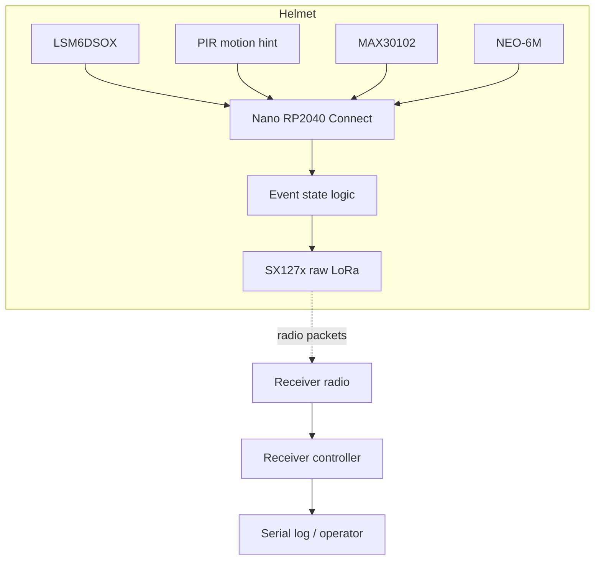

# System architecture

```mermaid
flowchart TB
  subgraph Helmet
    IMU[LSM6DSOX] --> MCU[Nano RP2040 Connect]
    PIR[PIR motion hint] --> MCU
    PPG[MAX30102] --> MCU
    GNSS[NEO-6M] --> MCU
    MCU --> FSM[Event state logic]
    FSM --> LORA[SX127x raw LoRa]
  end
  LORA -. radio packets .-> RXLORA[Receiver radio]
  RXLORA --> RXMCU[Receiver controller]
  RXMCU --> LOG[Serial log / operator]
```

All pin assignments and the radio frequency are provisional until the exact modules and board pinout are verified.
